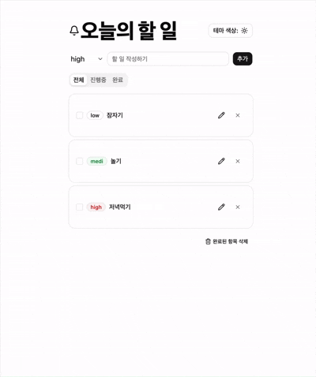

# 오늘의 할 일 (Todo list)

할 일 관리(Todo)

## ⚙️

- Framework / Environment: React 19, TypeScript, Vite
- State Management: Zustand
- Styling / UI Components: Tailwind CSS v4, shadcn/ui, Lucide Icons
- Development Tools: ESLint, PostCSS, Autoprefixer

## 📌

#### 기능

- **할 일 관리 (CRUD)**: 할 일 추가, 수정, 개별 삭제 기능
- **일괄 관리**: 완료된 항목만 필터링하여 한 번에 삭제하는 일괄 삭제 기능
- **상태 필터링**: 전체, 진행 중, 완료 상태별 실시간 목록 필터링

#### UI/UX 편의 기능

- **테마 스위칭**: `shadcn/ui` 환경 기반의 다크 모드 / 라이트 모드 전환
- **우선순위(Priority) 설정**: 할 일 생성 시 중요도 지정

 

## Getting Started

#### 1. 의존성 패키지 설치

pnpm install

#### 2. 로컬 개발 서버 실행

pnpm dev
